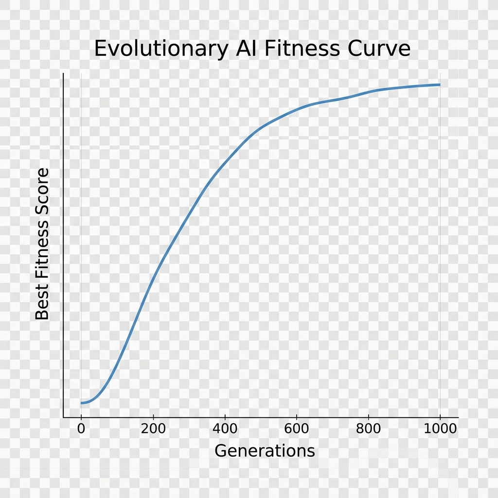
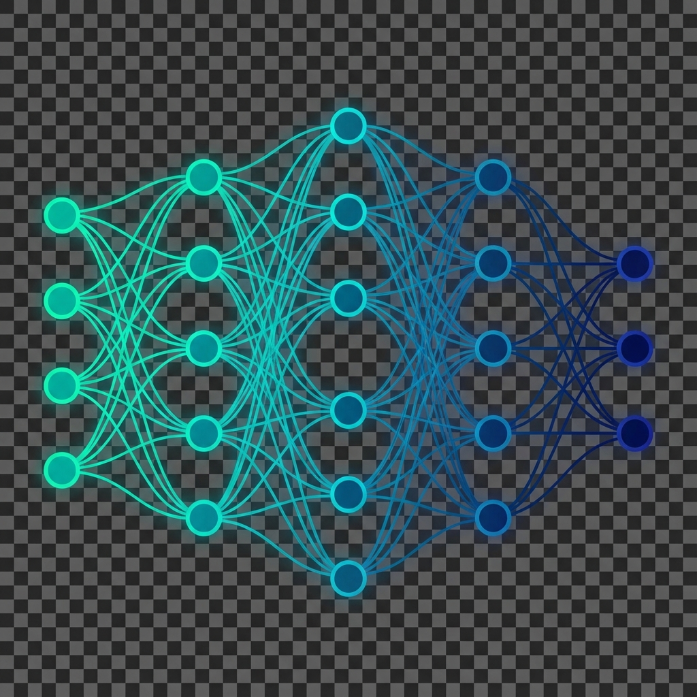

# NeuroGen


**NeuroGen** is an open‑source AI framework that replaces backpropagation with evolutionary search, genome‑driven network construction, and local learning rules (Hebbian, Oja, BCM, STDP). It enables neural architectures to evolve and adapt dynamically without gradients.

---

## Why NeuroGen?

- Backpropagation is biologically implausible and suffers from vanishing/exploding gradients.
- Fixed architectures limit flexibility.
- NeuroGen provides a **backprop‑free** alternative that automatically evolves architectures, learns locally, and dynamically mutates topology.

---

## Key Features (V1)

- Evolutionary search over neural architectures.
- Genome‑driven network construction.
- Local learning rules: Hebbian, Oja, BCM, STDP.
- Dynamic topology mutations (add/remove nodes & edges).
- XOR demo that evolves a perfect solution without gradients.

---

## Architecture Overview

1. **Genome** – compact representation of nodes, connections, and mutation parameters.
2. **Engine** – evolutionary loop handling evaluation, selection, crossover, and mutation.
3. **Learning Rules** – plug‑in modules for synaptic updates after each forward pass.

---

## Screenshots

<div align="center">
  
  
</div>


---

## Installation

```bash
git clone https://github.com/yourorg/NeuroGen.git
cd NeuroGen

# Optional: create a virtual environment
python -m venv venv
# Windows
venv\\Scripts\\activate
# Unix/macOS
source venv/bin/activate

pip install -r requirements.txt
```

Core dependencies: **NumPy**, **NetworkX**, **Matplotlib**. Install PyTorch separately if you need the optional dynamic network builder.

---

## Quickstart

```python
import neurogen
from neurogen.tasks import xor

xor.run_demo()
```

Run from the command line:

```bash
python -m neurogen.tasks.xor
```

---

## Benchmarks & Results

On a standard laptop (Intel i5, 8 GB RAM) NeuroGen consistently solves XOR within **150‑180 generations**. The fitness curve above shows rapid convergence.

---

## Roadmap

| Version | Milestones |
|---------|------------|
| **V1** (Current) | XOR demo, basic local rules |
| **V2** | Additional learning rules, novelty search |
| **V3** | Speciation, surrogate models |
| **V4** | Modular growth, gating mechanisms |

---

## Contributing

1. Fork the repository.
2. Create a feature branch (`git checkout -b feature/your-feature`).
3. Add tests for new functionality.
4. Ensure the test suite passes (`pytest`).
5. Submit a pull request.

All contributions should follow PEP 8 and update documentation as needed.

---

## Citation

```bibtex
@software{NeuroGen2025,
  author = {Sharma, Viraaj},
  title = {NeuroGen: Backprop‑Free Evolutionary AI Framework},
  year = {2025},
  url = {https://github.com/yourorg/NeuroGen},
}
```

---

## License

MIT License – see the `LICENSE` file.

---

## Acknowledgments

Inspired by **NEAT**, **Hebbian learning theory**, and broader **evolutionary computation** research.

---

## Contact

For questions, collaborations, or feature requests, reach out to **viraajsharma25@gmail.com**.

---

**Built with ❤️ for evolutionary AI research**
